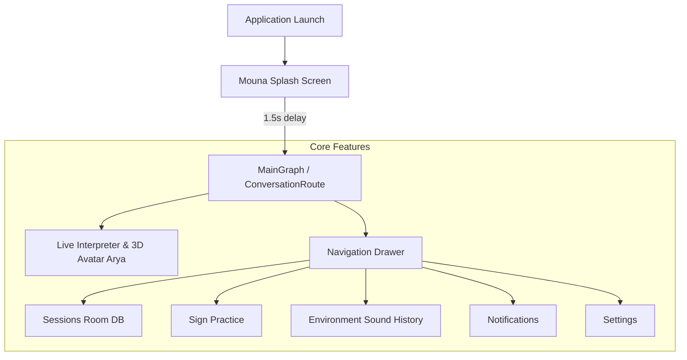

# Mouna - Architecture Summary & Technical Reference

## 1. System Overview
**Mouna** is an Android application designed for real-time sign language interpretation and speech transcription. It features a 3D animated avatar ("Arya") rendering Indian Sign Language (ISL) gestures, offline/online speech recognition, environmental sound recognition, and saved conversation sessions.



---

## 2. Component Breakdown

### 2.1. Navigation Architecture
- **Navigation Framework**: Jetpack Compose Navigation (`androidx.navigation:navigation-compose`).
- **Host Component**: `AppNavHost` located in `.../current/app/presentation/navigation/AppNavHostKt`.
- **Primary Routes**:
  - `AuthGraph`: Contains `SplashScreen`. Modified to immediately navigate into `MainGraph.INSTANCE` after 1.5 seconds.
  - `MainGraph`: Houses the main application scaffold, drawer host, and feature destinations.
  - `ConversationRoute`: The default destination within `MainGraph`, rendering the live speech-to-sign workspace.
  - `Bypassed/Eliminated Graphs`: `PersonaSurveyGraph` (onboarding survey) and `AuthRoute.SignInScreen` / `AuthRoute.SetupScreen` (credential/login screens).

### 2.2. User Interface & Design System
- **Framework**: Jetpack Compose (Material3).
- **Branding Assets**:
  - `res/mipmap-anydpi/ic_launcher.xml`: Adaptive icon referencing solid white background and centered 72dp Mouna emblem.
  - `res/drawable/lts_logo_hd.png`: High-resolution badge with emblem and typography.
- **Top Bar & Navigation Drawer**:
  - Drawer header: Branded as "Mouna".
  - Drawer items: Home (`ConversationRoute`), Sessions (`ConversationListRoute`), Sign Practice (`SignPracticeListRoute`), Sound History (`EnvironmentSoundHistoryRoute`), Notifications (`NotificationsListRoute`), Settings (`ConversationSettingsRoute`).
  - Logout action: Omitted from layout hierarchy.

### 2.3. Speech & Machine Learning Pipelines
- **Microsoft Cognitive Services Speech**: Native C++ / Java bindings (`libMicrosoft.CognitiveServices.Speech.core.so`) for speech-to-text recognition.
- **MediaPipe & TensorFlow Lite**: Native computer vision runtimes (`libmediapipe_tasks_jni.so`, `libtensorflowlite_jni.so`) supporting real-time face, gesture, and audio landmark tracking.
- **3D Avatar (Arya)**:
  - 3D models stored as `.glb` files inside `assets/` and rendered via WebGL / Filament web view component (`DraggableFloatingWebViewKt`).
  - Converts transcribed speech into standardized ISL animation sequences.
- **Audio Classification**:
  - Utilizes `yamnet.tflite` for real-time acoustic event detection.

### 2.4. Local Storage & Data Architecture
- **Room Database**: Local SQLite database storing conversation transcripts, session histories, and custom sign practice presets.
- **DataStore**: Encrypted preferences for language preferences, signing speed settings, font scaling, and speaker detection flags.

---

## 3. Project Directory Map
```text
c:\Users\abcsa\Downloads\Mouna\
├── Mouna.apk                      # Standalone, signed, aligned production APK
├── mouna.png                      # Source 1254x1254 brand asset
├── CHANGE_REPORT.md               # Detailed changelog & patch breakdown
├── ARCHITECTURE_SUMMARY.md         # Technical architecture documentation
├── apktool_smali/                 # Reconstructed buildable Android project
│   ├── AndroidManifest.xml        # Modified standalone manifest
│   ├── apktool.yml                # Apktool project configuration
│   ├── assets/                    # 3D GLB avatars, TFLite models, Web assets
│   ├── lib/
│   │   └── arm64-v8a/             # 14 consolidated native libraries (.so)
│   ├── res/
│   │   ├── drawable/              # In-app brand logos and vectors
│   │   ├── mipmap-*/              # Multi-density and adaptive launcher icons
│   │   └── values/
│   │       ├── strings.xml        # Rebranded strings (Mouna)
│   │       └── public.xml         # Resource ID mapping table
│   └── smali*/                    # Smali bytecode disassembly (classes 1-8)
├── decompiled_src/                # High-level Java/Kotlin decompiled sources (JADX)
├── tools/                         # Maintenance and generation utility scripts
│   ├── generate_assets.py         # Mipmap & drawable generator from mouna.png
│   ├── generate_splash_logo.py    # Splash emblem and typography compositor
│   └── rebrand_strings.py         # Automated string rebrand transformer
```

---

## 4. Rebuild & Reproduction Instructions
To rebuild `Mouna.apk` from the reconstructed `apktool_smali` source directory:

```powershell
# 1. Build unaligned APK
java -jar tools/apktool.jar b apktool_smali -o Mouna_unaligned.apk

# 2. 4-byte boundary alignment
& "C:\Users\abcsa\AppData\Local\Android\Sdk\build-tools\35.0.0\zipalign.exe" -v -p 4 Mouna_unaligned.apk Mouna_aligned.apk

# 3. Cryptographic signing
& "C:\Users\abcsa\AppData\Local\Android\Sdk\build-tools\35.0.0\apksigner.bat" sign `
    --v1-signing-enabled true `
    --v2-signing-enabled true `
    --v3-signing-enabled true `
    --ks "$env:USERPROFILE\.android\debug.keystore" `
    --ks-pass pass:android `
    --key-pass pass:android `
    --ks-key-alias androiddebugkey `
    --out Mouna.apk Mouna_aligned.apk

# 4. Verify signature
& "C:\Users\abcsa\AppData\Local\Android\Sdk\build-tools\35.0.0\apksigner.bat" verify --verbose Mouna.apk
```
