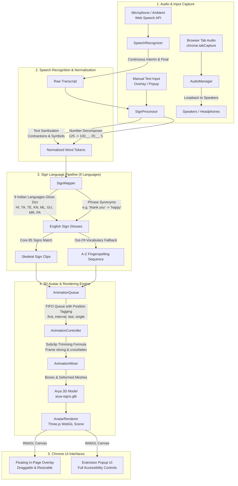

# Mouna — Real-Time Speech/Audio to Indian Sign Language Chrome Extension

> **Manifest V3 Chrome Extension** extracting and adapting the full 3D Avatar system ("Arya"), 85 skeletal animations, Indian Sign Language (ISL) gloss translations, and 9-language continuous speech pipeline from the **Mouna (Let's Talk Sign)** mobile application.

---

## 1. System Architecture



---

## 2. Extracted Assets & Core 3D System

All 3D assets and animations were extracted directly from the original mobile application without modifying or breaking any source files:

- **3D Character Model**: `assets/models/arya-signs.glb` (39.06 MB)
  - Character rig: **Arya** with full bone hierarchy, hand/finger armatures, clothing, hair, and face meshes.
  - Mesh compression: `KHR_mesh_quantization` + `EXT_meshopt_compression` (decompressed at runtime with `lib/meshopt_decoder.js`).
- **85 Skeletal Sign Animations**:
  - **Fingerspelling**: `a-22` through `z-22` (26 alphabetic sign clips).
  - **Numbers**: `0-23` through `9-23`, `20__-34` through `90__-35`, `100__-35`, `1000__-27`.
  - **Core Word Signs**: `after`, `and`, `angry`, `arya`, `before`, `coffee`, `endOfSentence`, `happy`, `have`, `he`, `hello`, `here`, `him`, `his`, `how`, `i`, `interpret`, `many`, `me`, `my`, `name`, `oh`, `problem`, `sad`, `she`, `small__pause__word`, `some`, `tea`, `their`, `there`, `they`, `this__`, `us`, `we`, `what`, `when`, `where`, `who`, `why`, `you`.
- **Subclip Timing & Trimming Formula**:
  The mobile application trims animation frames dynamically to prevent unnatural pauses between consecutive words. This extension preserves that exact formula:
  - Total frames: `frameCount = parseInt(clip.name.split('-')[1])`
  - Start frame: For non-first clips, trims leading `Math.min(5, Math.floor(frameCount * 0.08))` frames.
  - End frame: For non-last clips, trims trailing `Math.min(4, Math.floor(frameCount * 0.05))` frames.
  - Crossfades: Smooth `crossFadeTo()` transition over `0.3s / speed` between signs.

---

## 3. Supported 9 Indian Languages

The extension inherits the mobile app's bilingual gloss translation pipeline supporting all 9 major Indian languages:

| Language | Native Script | Language Code | Speech Recognition Locales |
| :--- | :--- | :--- | :--- |
| **English** | English | `en` | `en-IN`, `en-US` |
| **Hindi** | हिन्दी | `hi` | `hi-IN` |
| **Tamil** | தமிழ் | `ta` | `ta-IN` |
| **Telugu** | తెలుగు | `te` | `te-IN` |
| **Kannada** | ಕನ್ನಡ | `kn` | `kn-IN` |
| **Malayalam** | മലയാളം | `ml` | `ml-IN` |
| **Gujarati** | ગુજરાતી | `gu` | `gu-IN` |
| **Marathi** | मराठी | `mr` | `mr-IN` |
| **Punjabi** | ਪੰਜਾਬੀ | `pa` | `pa-IN` |

Words not present in the 85-sign vocabulary automatically gracefully fallback to **letter-by-letter fingerspelling** using clips `a-22` through `z-22`.

---

## 4. Installation Instructions (Load Unpacked)

1. Open Google Chrome.
2. Navigate to: `chrome://extensions`
3. Toggle on **Developer mode** in the top-right corner.
4. Click the **Load unpacked** button in the top-left toolbar.
5. In the file picker, select the extension directory:
   ```
   c:\Users\abcsa\Downloads\Mouna\mouna-chrome-extension
   ```
6. The **Mouna - Speech to Indian Sign Language** extension icon will appear in the Chrome toolbar.
7. Click the extension puzzle icon and pin **Mouna** to your toolbar for quick access.

---

## 5. Testing Guide (5 Verification Scenarios)

### Test 1 — Basic Speech & Single Sign
1. Open any website (e.g. `https://en.wikipedia.org` or `https://www.google.com`).
2. Click the Mouna extension icon to open the popup, or look at the floating in-page overlay in the bottom-right corner.
3. Click **START CONVERSION** (or **START** on the overlay).
4. Speak into the microphone: **"Hello"**.
5. **Expected Result**:
   - Status badge shows: `● Listening` → `Signing: hello`.
   - Arya performs the greeting sign animation.
   - Transcript box displays `"Hello"`.

### Test 2 — Multi-Word Sentence & Phrase Mapping
1. Ensure Mouna is active.
2. Speak: **"Good morning everyone, thank you"**.
3. **Expected Result**:
   - "good morning" maps to the `hello` sign.
   - "everyone" maps to `we` + `all`.
   - "thank you" maps to the `happy` sign.
   - All signs play sequentially with smooth crossfades and subclip trimming without stuttering or avatar resetting.

### Test 3 — Continuous Speech & Progressive Queueing
1. Speak a multi-clause sentence: **"He has a problem with tea and coffee"**.
2. **Expected Result**:
   - Progressive speech recognition updates interim tokens in real-time.
   - Queue enqueues `he` → `have` → `problem` → `tea` → `and` → `coffee`.
   - Animation controller plays signs in order without restarting from the beginning on each new word.

### Test 4 — 9 Indian Languages Testing
1. In the popup or floating overlay dropdown, select **हिन्दी (Hindi)**.
2. Speak or type: **"नमस्ते धन्यवाद"**.
3. **Expected Result**:
   - "नमस्ते" translates to sign `hello`.
   - "धन्यवाद" translates to sign `happy`.
4. Switch to **தமிழ் (Tamil)** and input: **"வணக்கம் நன்றி"**.
5. Switch to other languages (**తెలుగు**, **ಕನ್ನಡ**, **മലയാളം**, **ગુજરાતી**, **मराठी**, **ਪੰਜਾਬੀ**) to verify that native words map to their respective ISL signs.

### Test 5 — Meeting & Webpage Overlay Verification
1. Open a video meeting tab (e.g., Google Meet, Zoom web client) or YouTube lecture video.
2. Observe the floating in-page overlay:
   - **Draggable**: Drag the header to any corner of the screen.
   - **Resizable**: Drag the bottom-right corner handle to enlarge or shrink the 3D avatar viewport.
   - **Minimizable**: Click `_` to minimize to a compact floating badge when full-screen video is needed.
   - **Speed Control**: Toggle speeds (`0.8x`, `1.0x`, `1.25x`, `1.5x`) to adjust signing pace.
   - Select **Audio Capture Mode: Tab Audio** to capture audio playing inside the browser tab while maintaining speaker audio through Web Audio loopback.

---

## 6. Browser & Chrome Permissions / Limitations

- **Tab Audio Capture (`chrome.tabCapture`)**:
  - Chrome MV3 requires user activation (such as clicking the button in the extension popup) to begin capturing a browser tab's audio stream.
  - When `tabCapture` is initiated, Chrome automatically routes audio away from physical speakers. Mouna's `AudioManager` automatically creates a Web Audio `AudioContext` loopback (`sourceNode.connect(audioContext.destination)`) to ensure the user can still hear the video or meeting audio normally.
- **Chrome Internal Pages**:
  - Google Chrome security policy strictly prevents extensions from injecting content scripts or overlays into `chrome://`, `chrome-extension://`, and the Chrome Web Store. Use standard `http://` or `https://` webpages for in-page overlay testing.
- **Microphone Permissions**:
  - The first time speech recognition is enabled, Chrome will request microphone permission. The user must click **Allow**. If denied, Mouna displays a clear `"Mic Permission Denied"` status message.
- **WebGL Hardware Acceleration**:
  - Rendering the 3D avatar at 60 FPS requires standard WebGL support enabled in Chrome settings (`chrome://settings/system` → *Use graphics acceleration when available*).
